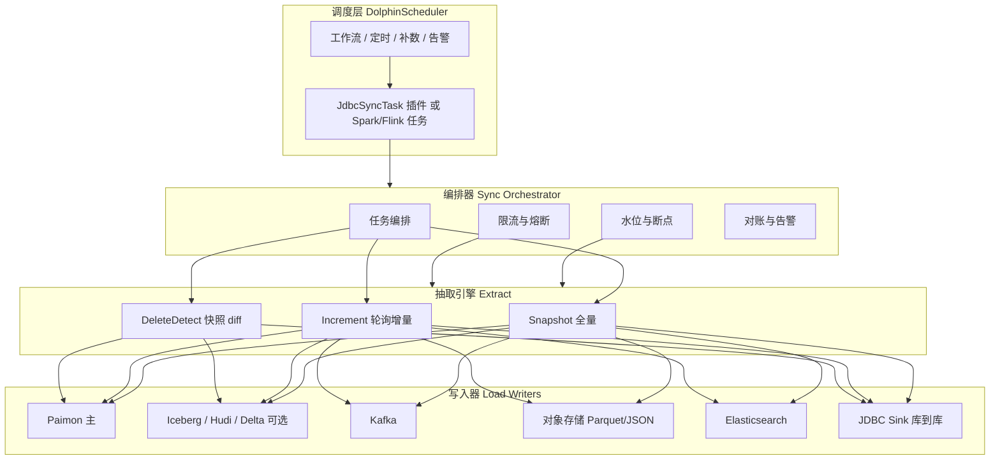
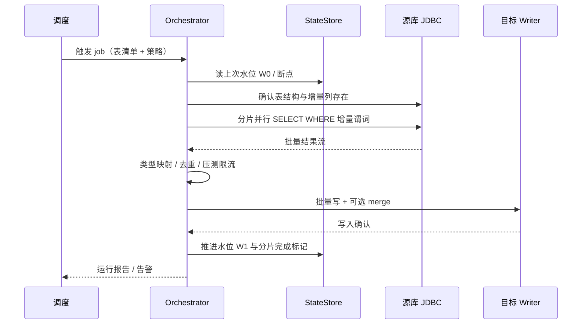
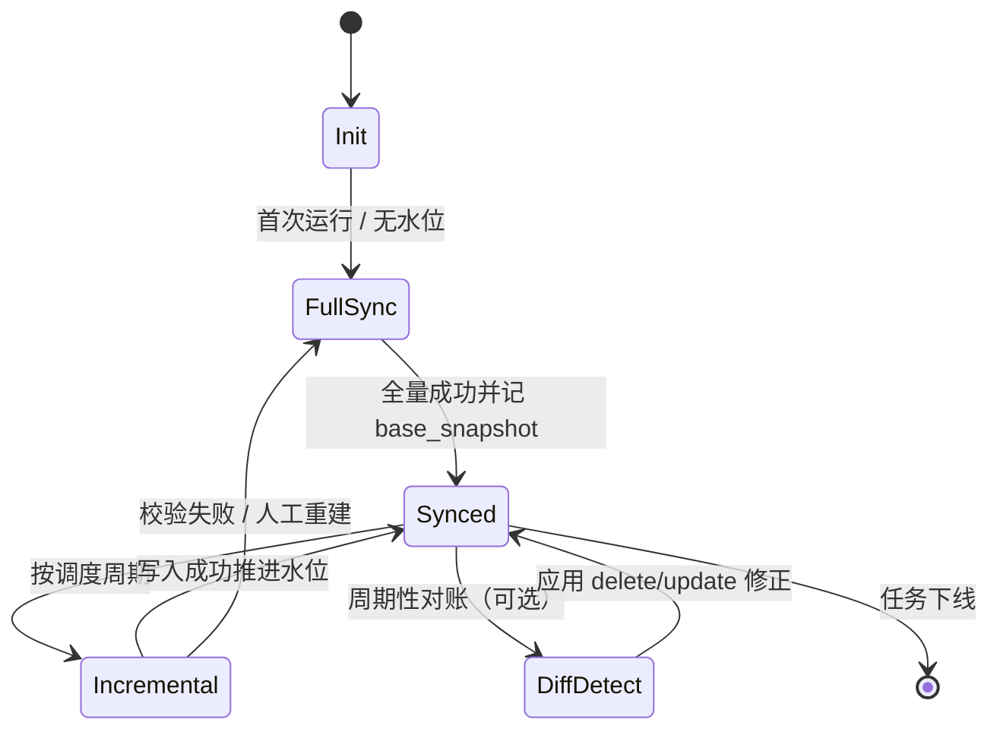
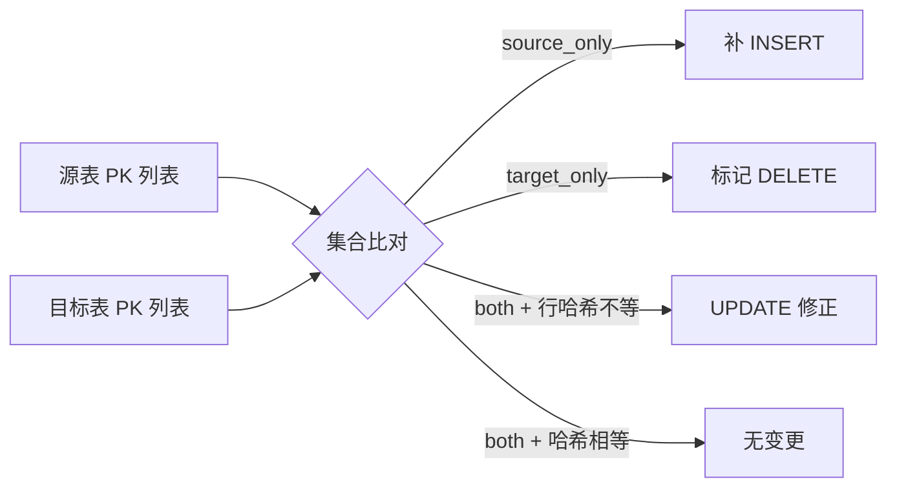
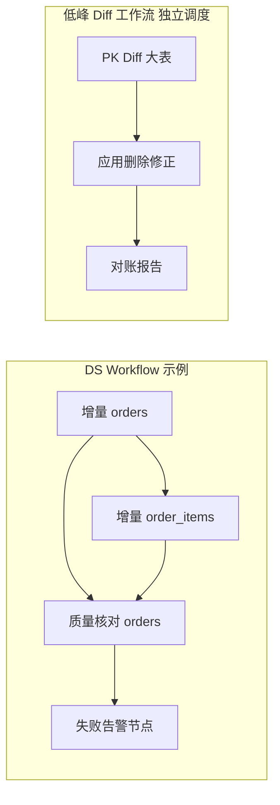

# 无 CDC 权限的 JDBC 同步组件 — 设计方案

> 目标：在**拿不到 binlog / WAL / 日志权限**的前提下，仅通过 JDBC 做全量与增量同步；增量靠自增 ID 或 `update_time`；架构上预留删除感知（类似 git 的 diff / 数据比对）；性能可控、可扩展到多源多目标。

## 0. 已拍板决策（v0.3）

| 决策项 | 结论 | 说明 |
|--------|------|------|
| 项目名 | **Weir**（备选 Siphon / Rill） | 见 §0.1 |
| 实现语言 | **Java 17**（编译目标） | 引擎与生态同 JVM；**不用 Java 21 做提速赌注** |
| 版本矩阵 | Flink **1.20** + Spark **3.5** + Paimon **1.0.1** | Flink 2.0 暂缓，见 §0.2 |
| 调度 | **DolphinScheduler 自定义任务插件** | 参考 DS 自带 `datax`/`seatunnel`/`flink` 任务插件 |
| 湖格式 | **Paimon 为主** | 主键 merge、部分更新、删除标记都合适 |
| 前端 | **不做重型前端** | 复用 DS UI；本组件只提供 CLI + 配置/状态 API |
| 同步范围 | **单表模式 + 受约束的 SQL 模式** | 见 §6.5 |
| 一致性 | **管道 at-least-once + 目标 PK merge ⇒ 业务 effectively-once** | 见 §0.3；并行分片不重叠，不靠「祈祷不重复」 |

### 0.1 项目命名

参考大数据组件常见风格（短词、自然/水利意象、易拼写）：

| 名称 | 含义 | 评价 |
|------|------|------|
| **Weir（推荐）** | 量水堰/低坝 | **控制并度量过水流量**，暗合 watermark/增量水位；与 Paimon（湖）意象连贯 |
| Siphon | 虹吸 | 无 CDC 权限也能把数据「吸」出来，记忆点强 |
| Rill | 细流 | 增量像细流，短、好拼 |
| Sluice | 水闸 | 批量启闭，表意准但略生僻 |
| Aqueduct | 渡槽 | 偏长 |

**推荐对外名：Weir**（中文可称「堰」）。Maven 坐标示例 `io.weir:weir-core`；CLI 名 `weir`。  
仓库目录可继续用 `opod`，产品名以 Weir 为准。

### 0.2 版本矩阵（按官方兼容线）

| 组件 | 生产推荐 | 不要现在上 | 依据 |
|------|----------|------------|------|
| **JDK** | **17**（编译 target 17） | 追求 21 提速 | Flink 2.0 默认/推荐 Java 17，Java 21 仅实验；同步瓶颈在 JDBC/IO，不在 JVM |
| **Flink** | **1.20.x** | **2.0.x 先别当主路径** | Paimon 1.0.1 官方 bundle 只到 `paimon-flink-1.20`；Flink 2.0 在 Paimon roadmap 里 |
| **Spark** | **3.5.x** | 4.x 先别当主路径 | Paimon 1.0.1 官方支持 Spark 3.2–3.5 |
| **Paimon** | **1.0.1** | 0.9 及更早 | 主路径湖格式 |
| **DolphinScheduler** | **3.2.x / 3.3.x** | — | Task Plugin SPI 成熟，已有 datax/seatunnel 等先例 |

**Flink 2.0 行不行？** 功能上可以用（2.0.1 已发布），但 **Paimon 官方尚未提供 flink-2.0 bundle**，自己编 Paimon 风险与维护成本高。  
**结论：主路径 Flink 1.20 + Paimon 1.0.1；等 Paimon 出 `paimon-flink-2.0` 再升。** 纯 Flink JDBC 作业不依赖 Paimon 的部分可以先试 2.0，但不作为交付基线。

**Java 21 会不会好一点？**  
对你这个场景：**几乎不会更快**。时间花在源库 SQL、网络、Paimon 写盘；虚拟线程也不能替 Flink/Spark 的 Task 线程模型提速。  
可以：**用 JDK 21 编译/跑 CLI 与插件进程**，但 `--release 17` 保兼容；**集群引擎按 Flink/Spark 官方支持的 Java 17 跑**。不要为了 21 去升 Flink 2.0。

### 0.3 性能与「精准一次」口径

**谁最快？**（同表、同并行度、同目标 Paimon PK 表）

| 路径 | 吞吐 | 延迟 | 说明 |
|------|------|------|------|
| 专用并行 JDBC 抽取（引擎外挂线程池） | 峰值吞吐往往最高 | 批级 | 框架开销最小，适合超大表全量 |
| **Spark 批 + JDBC 分片** | 全量/复杂 SQL/ diff 最稳 | 批级 | **全量与对账首选** |
| **Flink 微批 + JDBC 轮询** | 中高 | 分钟级 | **日常增量首选**；写 Paimon checkpoint 开销可控 |

速度优先级：**分片并行度 × fetch size × 列裁剪 × 批量写** ≫ Java 17/21 语言层差异。先调 SQL 与分片，再考虑换语言。

**并行会不会重复？** 会「读到两次」，但不应「落两份业务行」：

1. **ID range 分片**：半开区间 `[lo, hi)`，互不重叠 → 抽取阶段 **无重复行**  
2. **`update_time` 增量**：故意带 overlap，边界行可能被读两次 → 批内/写入端按 PK **keep-latest**  
3. **失败重试**：at-least-once → 目标 **Paimon PK merge** 吃掉重复  
4. **水位**：仅在该批全部写成功后推进 → 不丢后继数据  

**能不能保证精准一次？**

| 语义 | 能否保证 | 怎么保证 |
|------|----------|----------|
| 管道字节级 exactly-once（消息一条不重） | **不承诺** | 无 CDC + 轮询本质是 at-least-once |
| **业务 effectively-once（PK 最终一致、可重跑）** | **能** | 幂等 merge + 不重叠分片 + 成功后再推水位 |
| Kafka 端到端 EOS | 有条件 | 幂等生产者 + 事务/或消费端按 `pk+version` 去重 |
| 删除事件恰好一次 | **不能** | 无日志；用 diff 最终一致修正 |

对外 SLA 写：**「主键表 effectively-once，任务可安全重跑」**，不要写「exactly-once 管道」。

### 0.4 DolphinScheduler 对接（插件怎么做）

DS 官方任务插件目录里已有 `dolphinscheduler-task-datax`、`seatunnel`、`flink`、`spark`、`shell` 等，**Weir 照同一 SPI 做 `weir` 任务类型**即可。

```text
dolphinscheduler-task-plugin/
  dolphinscheduler-task-weir/          # 我们交付的插件模块
    WeirTaskChannelFactory             # 注册任务类型 weir
    WeirTaskChannel
    WeirTask extends AbstractTask      # 解析参数 → 调 weir-cli / 内嵌 WeirRunner
    src/main/resources/ui/params.json  # DS 前端表单（可选）
```

| 接入方式 | 工作量 | 体验 | 建议 |
|----------|--------|------|------|
| **A. 自定义 `weir` 任务插件** | 中 | DS 里有独立任务类型、参数表单、日志回传 | **正式交付** |
| B. `Shell` 调 `weir run -c job.yaml` | 低 | 能跑，参数散落在脚本 | **MVP 第一周** |
| C. DS `Flink`/`Spark` 任务提交 fat-jar | 低 | 能复用现有集群任务类型 | 与 A 并存 |

插件职责保持薄：**只做参数映射、进程/提交、日志与状态回传**；切分、水位、重试语义全在 Weir 核心库，避免绑死 DS 版本。

部署：`weir` 插件 jar 放到各台 **API/Worker** 的 `libs`/task-plugin 目录后滚动重启（以你们 DS 版本文档为准）。

---

**性能补充（Java 语言层）**

| 选项 | 对同步吞吐 | 结论 |
|------|------------|------|
| Java 17 | 基线，与 Flink 2.0 默认一致 | **采用** |
| Java 21 | 同 IO 密集任务提升可忽略；虚拟线程帮不了引擎 Task | CLI 可跑 21，编译 target 17 |
| Go/Rust | 自研 Writer 反而更慢交付 | 主组件不用 |

### 语言选型对比（拍板依据）

| 语言 | 与湖/计算引擎 | JDBC/方言 | 独立轻量 Runner | 结论 |
|------|----------------|-----------|-----------------|------|
| **Java 17** | Paimon/Spark/Flink 原生 | 完整 | 可 | **采用** |
| Kotlin/Scala | 同 JVM | 完整 | 可 | 可作构建补充，不单独选 |
| Go | Paimon Writer 要自造或走 HTTP | 驱动可，类型/方言成本高 | 轻量好 | 仅当「不要引擎、只写文件/Kafka」时考虑 |
| Rust | 生态最弱，集成 DS/Paimon 成本最高 | 有驱动 | 极致性能 | **不建议** |

若未来要极轻量边车同步，可再评估 Go 小工具做「JDBC → Kafka/文件」；**主组件保持 Java**，避免双栈维护。

---

## 1. 问题边界与约束

| 约束 | 含义 | 设计影响 |
|------|------|----------|
| 无 CDC 权限 | 只能 `SELECT`，无变更流 | 用「轮询 + 批量抽取」代替事件流 |
| 仅 JDBC | 标准 SQL 访问 | 谓词下推、分片并行、游标/分页可控 |
| 增量来源 | 自增/单调 ID，或 `update_time` | 两种增量策略 + 可组合 |
| 删除感知（后续） | 无法从日志拿到 DELETE | 快照比对 / 主键集合 diff / 软删列 |
| 多目标 | 数仓、Kafka、对象存储、ES、库到库 | Writer 插件化 |
| 性能 | 要好 | 并行分片、批量读写、限流、避免全表反复扫 |

**非目标（首期不做）：**

- 伪装成「近实时 CDC」保证秒级端到端一致性
- 捕获无主键表的精确行级变更（需单独策略，见 §6.3）
- 跨库分布式事务 / 两阶段提交

---

## 2. 运行形态选型（推荐结论）

### 推荐：**DolphinScheduler 调度 + Java 执行引擎（Spark 与 Flink 双 Runner，Paimon 优先）**

| 方案 | 适合场景 | 优点 | 缺点 | 结论 |
|------|----------|------|------|------|
| **Flink Runner** | 微批轮询、写 **Paimon** | Paimon 原生亲和；可分钟级；SQL 与 connector 成熟 | 资源常驻或频繁提交 | **Paimon 主路径** |
| **Spark Runner** | 大批量全量、复杂 SQL、diff 对账 | 并行 JDBC 分片与 shuffle join 强；适合 PK Diff | 微批新鲜度略粗 | **全量 / 对账 / 复杂 SQL** |
| 独立进程（DataX 风格） | 无引擎环境 | 轻 | 自建容错成本高 | 备选，不进 MVP |
| SeaTunnel 等插件 | 已有集成平台 | 复用 UI | 表达能力受限 | 可后期包装 |

**理由（结合已拍板项）：**

1. 调度固定 **DolphinScheduler**：工作流、定时、补数、告警全部外置；本组件不做调度器。
2. 湖固定 **Paimon**：主键 merge / 部分更新 / 消费链路完整，适合「无 CDC 增量 + 偶发删除修正」。
3. 语言 **Java**：Paimon、Flink、Spark、DS 插件、JDBC 方言同一生态。
4. 日常增量用 **Flink 微批 + Paimon merge**；全量、复杂 SQL、PK Diff 用 **Spark 批**。

**部署建议：**  
核心做成 **「Java 库（Extract/State/Writer）+ 两种 Runner + DS 任务插件」**。业务逻辑不绑死引擎；DS 里用 `JdbcSyncTask`（自定义）或 `Spark/Flink` 任务提交。



---

## 3. 总体架构

### 3.1 分层

| 层 | 职责 | 关键接口 |
|----|------|----------|
| **Config & Connector SPI** | 源端方言、类型映射、连接池、单表/SQL 提取定义 | `JdbcDialect`, `TypeMapper`, `SourceQuery` |
| **Extract** | 全量 / 增量 / 删除比对三种读取模式 | `SnapshotExtractor`, `IncrementalExtractor`, `DiffExtractor` |
| **State Store** | 水位、分片进度、快照指纹、对账结果 | `SyncCheckpoint`, `WatermarkStore` |
| **Transform（轻量）** | 类型归一、分区列补全、软删标记、去重 | 可选 UDF 链 |
| **Load** | 幂等写入各目标（**Paimon 优先**） | `Writer.write(batch)` / `merge` |
| **Orchestrator** | 单次 Run 编排、失败重试、SLA 报告；周期调度交给 DS | Job 配置驱动 |
| **Observability** | 指标、耗时、源库压力、抽样核对 | Metrics + 每次运行 Report |
| **Control（可选）** | 配置与状态查询 API / 极简运维页 | 无重型前端 |

### 3.2 一次增量任务的数据流



**水位推进原则：** 只有「该批次全部成功写入目标」后才把水位从 `W0` 推到 `W1`。失败重试从 `W0`（或分片断点）重来，保证 **at-least-once + 目标幂等 = 实际 exactly-once 效果**。

---

## 4. 增量同步设计（核心）

### 4.1 两种增量策略

#### 策略 A：单调递增 ID

适用：有自增主键或严格递增的 `id`（不含回填乱序）。

```sql
-- 水位式（简单）
SELECT * FROM t WHERE id > :last_id ORDER BY id LIMIT :batch;

-- 并行分片（性能）
SELECT * FROM t WHERE id >= :lo AND id < :hi;
-- 由 Orchestrator 先 SELECT MIN(id), MAX(id) 再均匀/按统计切片
```

| 优点 | 注意 |
|------|------|
| 边界清晰、易断点续传 | 更新已有行不会改变 id → **感知不到 UPDATE** |
| 并行分片容易 | 只能覆盖 INSERT 型增量 |
| 对源库友好（走主键索引） | 若还需更新，需配合策略 B 或 diff |

#### 策略 B：`update_time`（或版本列）

适用：业务表保证 `update_time` 更新时刷新，且有索引。

```sql
-- 带重叠窗口，防止边界丢数
SELECT * FROM t
WHERE update_time >= :watermark - :overlap
  AND update_time <  :batch_max_ts
ORDER BY update_time, id;
```

| 优点 | 注意 |
|------|------|
| 能覆盖 INSERT + UPDATE | 必须有 `update_time` 索引，否则全表扫 |
| 语义直观 | 时钟回拨 / 批量改时间需 overlap + 按主键 merge |
| | 同毫秒多行用 `(update_time, id)` 复合游标 |

#### 策略 C（推荐组合）：`update_time` 为主，`id` 作游标 tie-break

```
游标 = (last_update_time, last_id)
谓词 = (update_time > :ts) OR (update_time = :ts AND id > :id)
排序 = update_time ASC, id ASC
```

**首期建议：** 同时实现 A、B；配置里每表选一种；C 作为 B 的游标实现细节，而不是第三种模式。

### 4.2 全量同步（Snapshot）

- 用于初始化、修复、以及后续删除 diff。
- 必须并行：按数值主键 / 哈希分片 / 分区键切 range。
- 写入目标建议先进 **snapshot 分区 / staging 表**，再切换或 merge，避免半份数据。

```sql
-- 并行切分示意（PK 为 bigint）
SELECT MIN(id), MAX(id) FROM t;
-- 任务配置 splitCount=N，每个 executor 跑一个 range
SELECT ... FROM t WHERE id >= :lo AND id < :hi;
```

**分片策略优先级：**

1. 显式分区列（日期、区域等）
2. 数值/主键 range 均匀切
3. `id % N` 取模（有主键但不连续时）
4. 单连接 + fetch size（最后手段）

### 4.3 运行模式状态机



---

## 5. 删除感知（后续能力，架构先预留）

无 CDC 时拿不到 DELETE 事件，只能「看见结果再对账」。按成本从低到高：

### 5.1 软删除列（若有，优先）

- 源表有 `is_deleted` / `deleted_at`：把删除当普通 `update_time` 增量行下发，目标端做逻辑删或物理删。
- 零额外扫描成本，**应作为首选探测源**。

### 5.2 主键集合 Diff（类似 git 的 index diff）

定期（如 T+1 或每周）做：

```
1. 从源表抽 PK 全集（只抽主键列，列裁剪，成本低）
2. 从目标当前表抽 PK 全集
3. full outer join / anti join：
   - source_only  → INSERT 补录
   - target_only  → DELETE（软删或物理删）
   - both         → 可选再比对行哈希 → UPDATE
```



**行哈希：** 对业务列做规范化后 `xxhash64`/`md5`（null 与空串规则先约定）。只需在 diff 任务里算，日常增量不算，控制成本。

### 5.3 分区指纹快照（大表优化）

- 按分区键（天/月）算 `count + sum(hash) + min/max(ts)` 指纹。
- 指纹不一致才下钻到该分区做行级 diff。
- 类似 git 只在 blob 变化时深入比较，避免每次全表对碰。

### 5.4 能力分期

| 阶段 | 内容 | 侵入性 |
|------|------|--------|
| P0 | 配置预留 `delete_detect_mode: none\|soft_column\|pk_diff\|fingerprint` | 无 |
| P1 | 软删列识别与下发 | 低 |
| P2 | PK Diff 任务 + 修正写入 | 中 |
| P3 | 分区指纹加速 + 行哈希 UPDATE 判定 | 中 |

**注意：** PK Diff 是「近似最终一致」，不是事务性捕获删除；两次 diff 之间的删除会延迟暴露。要在文档和 SLA 里写清楚。

---

## 6. 源端连接器设计

### 6.1 Dialect SPI

```
JdbcDialect
  ├── quoteIdentifier
  ├── buildIncrementQuery(watermark, batch, mode)
  ├── buildSplitQuery(range)
  ├── getMinMax / getPartitions
  ├── typeMapping (JDBC → 规范类型)
  └── supportsFeature(merge, upsert, returning, ...)
实现：MySQLDialect, PostgresDialect, OracleDialect, SqlServerDialect
```

### 6.2 类型归一模型

内部用中立类型，再映射到目标：

| 规范类型 | MySQL | PG | Oracle | SQL Server | Paimon/Iceberg | Kafka/JSON |
|----------|-------|----|--------|------------|--------------|------------|
| int64 | BIGINT | BIGINT | NUMBER(19) | BIGINT | BIGINT | long |
| decimal(p,s) | DECIMAL | NUMERIC | NUMBER(p,s) | DECIMAL | DECIMAL | string/number |
| string | VARCHAR/TEXT | TEXT | VARCHAR2 | NVARCHAR | STRING | string |
| timestamp | DATETIME(3) | TIMESTAMPTZ | TIMESTAMP | DATETIME2 | TIMESTAMP | long/string |
| bool | TINYINT(1) | BOOLEAN | NUMBER(1) | BIT | BOOLEAN | boolean |
| bytes | BLOB | BYTEA | BLOB | VARBINARY | BINARY | base64 |

统一附带：源类型名、precision/scale、nullability，供 schema evolution 与目标 DDL 生成。

### 6.3 无主键表（边界情况）

- 要求配置 `business_key` 或 `row_hash` 作为逻辑主键。
- 无任何唯一键：仅支持全量覆盖同步，增量与删除 diff **明确拒绝**（fail fast），避免静默丢数。

### 6.4 增量列前置检查（每次任务启动）

1. 增量列是否存在、类型是否可比较  
2. 是否有可用索引（`EXPLAIN` 或元数据），否则告警或拒绝（可配置 override）  
3. 源端 max(watermark) 与本地水位的关系（回退则告警）  
4. 权限：目标 schema 是否可写；是否允许 `CREATE TABLE`

### 6.5 同步范围：单表 vs 复杂 SQL

**结论：两种模式都支持，能力分层；MVP 只做单表，SQL 模式带硬约束。**

| 模式 | 形态 | 增量 | 并行分片 | 删除 diff | 适用 |
|------|------|------|----------|-----------|------|
| **A. 单表**（默认/推荐） | `table` + 列裁剪 + 可选固定 WHERE | 完整支持 id / update_time | 易（PK/分区键） | 完整支持 | ODS 贴源、绝大多数表 |
| **B. 受约束 SQL** | 用户给 `query`，组件包一层 | 支持，但有投影约定 | 需 `split_column` 在结果中 | **默认不支持** | 多表 join 宽表、派生列、过滤清洗 |
| **C. 自由 SQL** | 任意 SELECT | 不支持增量 | 不支持 | 不支持 | 仅全量覆盖 / 临时导出 |

#### 模式 A：单表

```yaml
source:
  read:
    mode: table
    table: public.orders
    columns: [id, user_id, status, amount, update_time, is_deleted]
    filter: "status <> 'TEST'"     # 可选，常量谓词，必须可下推
```

#### 模式 B：复杂 SQL（带契约）

用户 SQL 必须满足：

1. **外层可包一层**：组件生成  
   `SELECT <projection> FROM ( <user_sql> ) t WHERE <incremental> AND <split>`  
2. **投影出契约列**（可别名，配置里写明映射）：
   - `primary_key`（合并/去重/diff 用）
   - `incremental_column`（如 `update_time` 或 `id`）
   - 可选 `split_column`（要并行时，通常与 PK 相同）
   - 可选 `soft_delete_column`
3. **禁止**在结果里依赖未投影的不稳定表达式做水位（水位列必须是可比较标量）。
4. **增量谓词下推**：优先拼进子查询内层（性能）；无法下推时降级为外层过滤并告警。
5. **join 维度表**：允许，但维度表变更本组件**不感知**；维表应用「小表全量广播/每批重拉」或离线维表同步。

```yaml
source:
  read:
    mode: query
    query: |
      SELECT o.id, o.user_id, o.amount, o.update_time,
             u.channel, o.is_deleted
      FROM orders o
      JOIN users u ON u.id = o.user_id
    contract:
      primary_key: [id]
      incremental_column: update_time
      split_column: id
      soft_delete_column: is_deleted
```

#### 模式限制（fail fast，不静默）

| 场景 | 行为 |
|------|------|
| SQL 模式未给出 PK + 增量列 | 拒绝启动 |
| SQL 模式要求删除 diff | 拒绝（回模式 A 或关掉 diff） |
| 自由 SQL（无契约）却要求增量 | 拒绝 |
| 无主键且非全量覆盖 | 拿绝 |

**推荐默认：** 贴源 ODS 一律模式 A；宽表/汇总用模式 B 同步到 ODS/DWD，并接受「删除需 diff 或数仓侧处理」。

---

## 7. 目标端 Writer

| Writer | 写入语义 | 建议 |
|--------|----------|------|
| **Paimon** | **primary key merge / 部分更新 / 删除** | **首选湖目标**，幂等重跑友好 |
| Iceberg / Hudi / Delta | merge / upsert on PK | 可选，已有湖存量时再做 |
| Hive 外表 | append 分区文件 | 仅历史兼容；新表不推荐 |
| Kafka | append JSON/Avro/Protobuf | 按 PK 分区保证分区内有序 |
| 对象存储 | Parquet/JSON/CSV 目录 | 按 `dt=yyyy-MM-dd/hour=` 分区 |
| Elasticsearch | `_bulk` upsert / delete | 以 `_id`=PK，天然幂等 |
| JDBC Sink | `INSERT` / `MERGE` | 各方言 MERGE；无 MERGE 则 staging+交换 |

**Paimon 要点：**

- 主键表（primary key table）承接 upsert；`merge-engine` 可用 `deduplicate` 或 `partial-update`
- 删除：软删标记可映射 Paimon 删除行（`rowkind`）或业务列；diff 任务写 `-D` 行
- 分区：按业务日期或同步日；配置 `write-mode: merge`
- 与 Flink Runner / Spark Runner 均可写

**幂等约定（全局）：**

- 消息/文件：带 `event_time`、`op`（c/u/d）、`src_pk`、`src_ts`、`run_id`
- 湖格式：PK merge；同一 `run_id` 重跑可覆盖
- 库到库：优先 `MERGE`；禁止「先 DELETE 再 INSERT」无版本保护

---

## 8. 性能设计（必须做对的部分）

### 8.1 读侧

| 手段 | 说明 |
|------|------|
| 列裁剪 | 只 SELECT 用到的列，禁止 `SELECT *` 作为默认 |
| 谓词下推 | 增量条件与分片条件全部下推到 SQL |
| 分片并行 | 调 Flink/Spark 并行度与自定义 split，受连接池上限约束 |
| fetch size | MySQL `useCursorFetch=true` + fetchSize；PG `fetchSize`；Oracle `defaultRowPrefetch` |
| 增量优先 | 日常只跑增量；全量只在初始化/修复/低峰 diff |
| 只拉 PK 列做 diff | 删除对账不拉宽行 |
| 统计信息驱动切片 | 避免热点分片（大 V 分区、id 空洞） |

### 8.2 写侧

| 手段 | 说明 |
|------|------|
| 批量写 | DataFrame batch write / JDBC batch insert / ES bulk |
| 小文件控制 | 写 Paimon/Parquet 前 coalesce；按分区合并 |
| 去重 | 同一批内按 PK keep-latest（按 update_time/版本） |
| 延迟物化 | 不必要的维表关联能延后则延后，源库少 join |

### 8.3 源库保护（无 CDC 环境更容易打爆 OLTP）

- **全局令牌桶**：每源实例 `max_concurrent_queries`、`max_rows_per_sec`
- **熔断**：源库 CPU / 慢查询超阈值则自动降并行或暂停
- **时间窗**：全量与 diff 只在低峰调度
- **只读账号** + `query_timeout` + 单次 statement 上限
- 输出指标：`rows_read`、`bytes_read`、`query_duration`、`inflight_connections`

### 8.4 语义与延迟目标（建议写进 SLA）

| 模式 | 新鲜度 | 一致性 |
|------|--------|--------|
| 全量 | 小时级 | 某一近似快照（含长跑期间变更，需说明） |
| 增量 ID/时间戳 | 分钟～小时（调度周期 + 耗时） | at-least-once + 目标 merge 幂等 |
| 删除 diff | 小时～天 | 最终一致，暴露延迟 ≤ diff 周期 |

**不承诺：** 源端同事务多表原子可见、跨表外键顺序无环时的全局事务一致（可用「分批按依赖顺序同步」部分缓解）。

---

## 9. 状态、断点与容错

### 9.1 State 存储

可用嵌入式 SQLite / MySQL 小表 / Paimon 系统表旁路元数据表：

```
sync_state(
  job_id, table_id,
  mode,                 -- full | incremental | diff
  watermark_ts, watermark_id,
  full_min, full_max,   -- 全量分片范围
  shard_id, shard_done, -- 断点
  last_success_run_id,
  updated_at
)

sync_run_log(
  run_id, job_id, started_at, finished_at,
  rows_in, rows_out, rows_deleted,
  status, error_message, report_json
)

diff_snapshot_meta(
  table_id, snapshot_id, fingerprint, created_at
)
```

### 9.2 失败策略

| 失败点 | 行为 |
|--------|------|
| 抽取中断 | 保留分片断点，重跑未完成 shard |
| 写入中断 | 不推水位，整批重试；湖格式 staging 丢弃重来 |
| 水位写入失败 | 视为任务失败（避免重复却不告警） |
| 长时间源库异常 | 熔断 + 告警，支持从人工指定水位恢复 |
| Schema 变更 | 兼容变更（加列）自动追加；不兼容变更 fail 并冻结该表 |

### 9.3 Schema Evolution

- 加列：目标追加列，旧数据 null
- 删列：宽表策略下保留并置 null（可配置 purge）
- 类型变宽：自动；变窄：拒绝并告警
- 表结构哈希写入每次 run log，便于追溯

---

## 10. 配置模型（示意）

```yaml
job:
  name: order_sync
  schedule: "*/5 * * * *"          # 或由外层调度平台触发
  mode: incremental                 # full | incremental | diff

source:
  type: mysql
  url: jdbc:mysql://host:3306/oltp
  user: sync_reader
  password: ${SECRET}
  pool_max: 8
  read:
    mode: table                      # table | query（复杂 SQL 见 §6.5）
    table: public.orders
    columns: [id, user_id, status, amount, update_time, is_deleted]
    incremental:
      strategy: update_time_id      # id | update_time | update_time_id
      column: update_time
      id_column: id
      overlap: 5m                   # 防边界丢数
      batch_rows: 50000
    splits:
      column: id
      num_partitions: 8
    delete_detect:
      mode: soft_column             # none | soft_column | pk_diff | fingerprint
      soft_column: is_deleted

target:
  type: paimon
  catalog: lake
  table: ods.orders
  write_mode: merge                 # merge | append | overwrite
  primary_key: [id]
  merge_engine: deduplicate         # deduplicate | partial-update

quality:
  row_count_check: true
  sample_hash_check: 0.01           # 1% 抽样行哈希核对
  watermark_max_lag: 2h

runtime:
  engine: flink                     # flink（日常增量→Paimon）| spark（全量/diff/复杂SQL）
  flink_conf:
    parallelism: 4
  spark_conf:
    spark.sql.shuffle.partitions: 16

schedule:
  platform: dolphinscheduler
  # cron / 依赖 / 补数 / 告警组都在 DS 工作流里配置
```

---

## 11. 任务编排形态（DolphinScheduler）

**已拍板：调度统一用 DolphinScheduler，交付 `weir` 自定义任务插件。**

### 11.1 接入方式

| 方式 | 做法 | 建议 |
|------|------|------|
| **自定义任务 `weir`（推荐）** | 对齐 DS `task-datax`/`task-seatunnel` SPI：`TaskChannelFactory` + `AbstractTask` | 参数校验、重试、日志回传最顺 |
| DS `Spark` / `Flink` 任务 | 提交 fat-jar，配置走参数或配置中心 | 改造成本低，适合 MVP |
| 外部 CLI | DS `Shell` 任务调 `weir run -c job.yaml` | 最快落地，可观测性弱一些 |

### 11.2 工作流形态



- **增量工作流**：分钟/小时级；一表一任务节点，失败隔离  
- **全量 / Diff**：独立工作流，低峰 cron，依赖增量任务窗口  
- **补数**：直接用 DS 的补数 + 人工指定水位参数  
- **密钥**：DS 参数/密钥管理，禁止明文进 git

多表任务建议：

- **一表一 DS 节点**（推荐）：失败隔离、补数粒度细  
- **同库多表一组**：连接复用，适合大批量小表；用 DS 任务组/子工作流管理

### 11.3 前端 / 控制面（明确范围）

| 能力 | 是否做 | 形态 |
|------|--------|------|
| 工作流/定时/补数/告警 | **不做** | DolphinScheduler UI |
| 任务配置编辑 | **不做重型表单** | Git 里的 YAML + MR；或 DS 任务参数 |
| 水位/运行状态查询 | 可选 | CLI：`jdbc-sync state/show`；HTTP 只读 API |
| 对账报告浏览 | 可选 | 报告写 Paimon/文件，DS 链到对象存储；或极简单页 |
| 血缘/数据目录 | 不做 | 对接公司元数据平台（Atlas/Wherehows/DataHub） |

**结论：首期零前端开发。** 只有当配置量变大、多租户自助接入时，再加「配置注册 + 状态看板」极简 Web（读 State API），仍不重复造调度 UI。

---

## 12. 可观测性与对账

每次 run 输出：

- 指标：`lag`（now - watermark）、`rows_per_sec`、`duration`、`src_qps`
- 报告：计划增量窗口、实际行数、去重丢弃数、写入重试数
- 核对：
  1. `count` 对比（增量窗口内）
  2. 抽样主键行哈希
  3. 周期 PK Diff 覆盖率

告警：水位落后超阈值、源库压力超限、schema 漂移、连续失败。

---

## 13. 模块与代码结构（建议）

```
weir/
  weir-api/                 # SPI：Dialect, SourceQuery, Extractor, Writer, State
  weir-dialect-mysql/
  weir-dialect-postgres/
  weir-dialect-oracle/
  weir-dialect-sqlserver/
  weir-extract/             # full / incremental / diff；table & query 模式
  weir-state/
  weir-writer-paimon/       # 主路径
  weir-writer-iceberg/      # 可选
  weir-writer-kafka/
  weir-writer-jdbc/
  weir-writer-es/
  weir-writer-files/
  weir-flink/               # Flink 1.20 Runner（日常增量 → Paimon）
  weir-spark/               # Spark 3.5 Runner（全量 / diff / 复杂 SQL）
  weir-cli/                 # weir run|state|diff|check
  weir-ds-plugin/           # DolphinScheduler weir 任务插件
  weir-quality/             # count & hash 核对
```

技术选型建议：

| 项 | 建议 |
|----|------|
| 语言 | **Java 17**（`--release 17`；运行可 17/21） |
| 项目名 | **Weir** |
| 构建 | Maven 多模块 |
| Flink | **1.20.x**（2.0 待 Paimon 官方 jar） |
| Spark | **3.5.x**（4.x 待 Paimon） |
| 湖格式 | **Paimon 1.0.1 主** |
| 调度 | DolphinScheduler 3.2+，自定义 `weir` Task Plugin |
| 状态 | 先 JDBC 小表，保证多 attempt 可查 |
| 前端 | 无；CLI + DS UI + 可选只读 API |

---

## 14. 里程碑

| 阶段 | 交付 | 验收 |
|------|------|------|
| **M1 MVP** | Java 核心库；MySQL 单表全量 + `id` 增量 → **Paimon**；DS Shell/Spark 任务接入；水位与重试 | 重启不丢不重（merge 后行数一致） |
| **M2** | `update_time(+id)` 增量；多表；分片并行；限流；Flink Runner 写 Paimon | 源库不被打爆；lag 可控 |
| **M3** | PG/Oracle/SQLServer；**SQL 模式（带契约）**；Kafka / JDBC Sink | 单表+SQL 双模式；3 源 3 目标互通 |
| **M4** | `weir` DS 任务插件；软删列；质量核对；schema 加列 | DS 上可配任务/补数/告警；抽样 hash 一致 |
| **M5** | PK Diff / 分区指纹删除感知；报告 | 构造删除场景可被检出并修正 |
| **M6（可选）** | 只读状态 API / 极简运维页；Iceberg 等 Writer；SeaTunnel 包装 | 自助查水位；多湖格式可选 |

---

## 15. 风险与对策

| 风险 | 对策 |
|------|------|
| `update_time` 未被业务更新或可被改小 | 水位 overlap + 复合游标；定期 diff 兜底；上线前数据剖析 |
| 无索引增量列导致全表扫 | 启动检查拒绝；文档要求 DBA 加索引 |
| 长事务更新先见后不见 | merge 幂等 + diff 修正；不承诺快照隔离 |
| 全量期间源数据变化 | 以 `batch_ts` 或日终为准；报告中声明快照语义 |
| 删除延迟暴露 | 明确 diff 周期 SLA；关键表提高 diff 频率 |
| 大表 diff 成本高 | 分区指纹 + 低峰调度 + 只拉 PK |
| 多目标类型不一致 | 规范类型层 + Writer 各自映射测试集 |
| 复杂 SQL 无法下推增量谓词 | 强制契约列；内层下推失败则降级并告警；严重时退回单表模式 |
| 维表 join 变更不感知 | 维表独立任务每批重拉，或数仓侧补关联 |
| 双 Runner（Flink/Spark）维护成本 | 核心逻辑进 `weir-extract`/`weir-writer`，Runner 只做适配 |
| 误报 exactly-once | 对外统一「effectively-once / 可安全重跑」，文档与告警一致 |
| 升 Flink 2.0 / Spark 4 无 Paimon jar | 基线锁 1.20/3.5；升级单独立项并做回归 |

---

## 16. 总结建议（已拍板后的执行口径）

1. **项目名 Weir**；语言 **Java 17**；不要 Go/Rust 做主组件，也**不要赌 Java 21 提速**。  
2. **版本基线：Flink 1.20 + Spark 3.5 + Paimon 1.0.1**；Flink 2.0 / Spark 4 等 Paimon 官方 jar。  
3. **调度 DolphinScheduler 自定义 `weir` 任务插件**；MVP 可用 Shell 调 CLI。不自研前端。  
4. **湖格式 Paimon PK merge**；一致性口径是 **effectively-once（可安全重跑）**，不是管道 EOS。  
5. **并行 ID 分片用半开区间不重叠**；`update_time` 允许 overlap + 按 PK 去重。  
6. **执行：Flink 微批日常增量 → Paimon；Spark 全量/复杂 SQL/删除 diff。**  
7. **同步范围：单表 + 受约束 SQL**；自由 SQL 只做全量。  
8. **MVP**：MySQL 单表 → Paimon 全量/`id` 增量，Shell 接 DS，再做 `weir` 插件与删除对账。

---

*文档版本：v0.3（命名 Weir、版本矩阵、DS 插件、effectively-once、Java 17/21）· `jdbc-sync-design.md`*
